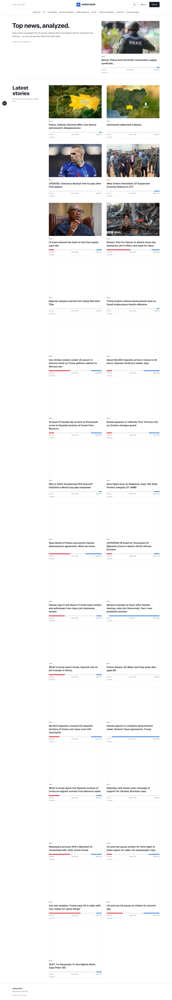
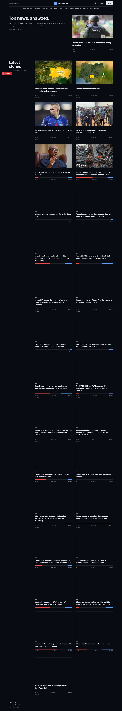
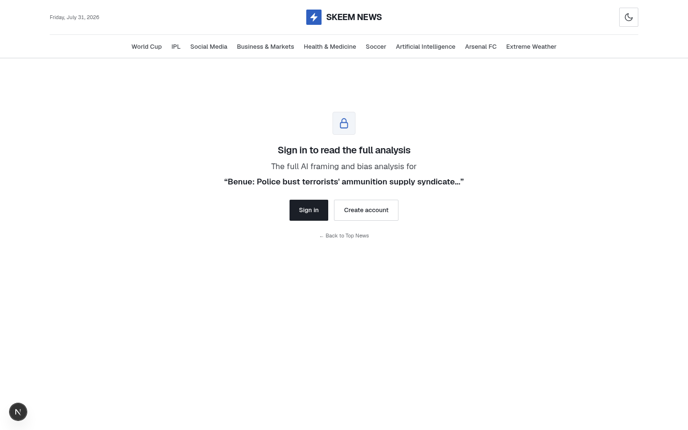
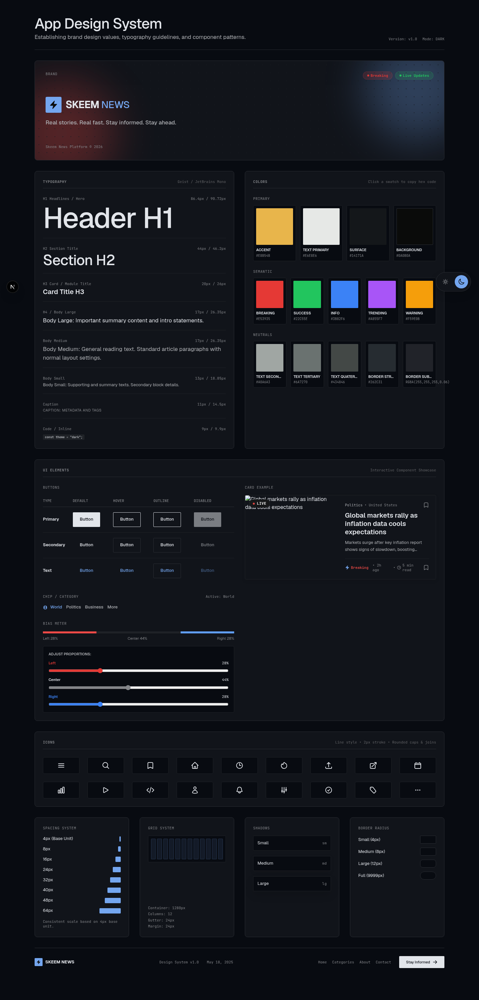

# skeem

**News articles analysis powered by AI.** skeem fetches real articles from configured news sources, reads them with AI, and surfaces things no ordinary reader would see — the sentiment, the framing, the loaded language, and how confident the machine really is about any of it.

It is not a news aggregator. Every story on the homepage was scraped, cleaned, validated, analyzed, embedded, and cross-linked with similar stories — automatically, once per hour.

> *Real stories. Real fast. Stay informed. Stay balanced.*

---

## A look at it

**Homepage** — a newspaper-style masthead, a featured story, and a grid of story cards. Each card carries its own left / center / right bias bar. Light theme is the brand default; dark mode is one tap away.





**Article details** — the full read alongside a bias breakdown, an AI summary, framing notes, loaded terms, and a per-source split. (Signed-out visitors see an analysis gate.)



**Design system** — the full token, type, and component reference, browsable live at `/design-system`.



---

## What it does

- **Scrapes real sources.** Reads article links from source homepages, follows them to the detail pages, and discards everything that isn't a true article — category pages, live blogs, podcasts, shopping links, author pages, and more (see the non-article reject list in `AGENTS.md`).
- **Two scraper providers.** A free **direct** fetch (plain HTTP with browser headers — the default on this branch) and the paid **Oxylabs** Web Scraper API. Switch with one env var; no code changes.
- **Analyzes with AI.** Produces a neutral summary, a sentiment score and label, and an *estimated* political framing breakdown (left / center / right percentages) for each article — always an estimate, never objective truth.
- **Finds related stories.** Each analysis is embedded with `gemini-embedding-001` and stored in pgvector, powering a *Related stories* section that surfaces up to five semantically similar articles by cosine similarity.
- **Runs itself.** Once wired up, an hourly schedule scrapes every active source homepage, inserts new articles, and analyzes whatever is pending — no babysitting required.
- **Keeps receipts.** Every pipeline run logs its activity — sources scanned, candidates found and rejected, duplicates skipped, articles inserted, errors — to both the dev-server terminal and a `logs` table.

## The whole pipeline, end to end

```
 active sources (Supabase)
            │
            ▼
   fetch homepage HTML  ──►  direct (free) or Oxylabs (paid)
            │
            ▼
 extract candidate links  ──►  visible story cards only
            │
            ▼
 reject non-articles  ──►  dedupe  ──►  skip URLs already in Supabase
            │
            ▼
 scrape detail pages  ──►  validate + clean  ──►  insert (append-only)
            │
            ▼
 AI analysis (summary · sentiment · framing · confidence)
            │
            ▼
 text embedding  ──►  pgvector  ──►  homepage + details UI + related stories
```

Manual and scheduled scraping share the **same pipeline** — the only difference is how the homepage HTML is obtained (live fetch vs. a stored scheduler result).

## Tech stack

| Layer          | Tool                                                        |
| -------------- | ----------------------------------------------------------- |
| Framework      | Next.js 16 (App Router) + React 19                          |
| Language       | TypeScript (strict)                                         |
| Auth           | Clerk                                                       |
| Database       | Supabase (Postgres + pgvector)                              |
| Scraping       | Direct fetch or Oxylabs Web Scraper API + Scheduler, Cheerio |
| AI             | Vercel AI SDK via OpenRouter (`google/gemini-2.5-flash` analysis, `text-embedding-3-small` embeddings) |
| Validation     | Zod                                                         |
| Styling        | Tailwind CSS v4 + shadcn/ui                                 |
| Scheduling     | Vercel Cron / GitHub Actions                                |
| Analytics      | PostHog                                                     |

## Design language

skeem follows a custom **Hallmark** design system — editorial in tone, built on a single typeface family with a cool-blue accent over a light paper canvas, with a full dark counterpart. Browse it live at `/design-system`.

- **Type.** [Geist](https://vercel.com/font) for everything — headlines, body, UI, and metadata. Sentence-case labels; tabular numerals for dates, percentages, and counts.
- **Color (light).** A cool-blue accent (`oklch(51% 0.16 262)`) over a near-white paper canvas (`oklch(96.8% 0.007 262)`), with a semantic set — breaking red, info blue.
- **Color (dark).** The same accent lifted to `oklch(72% 0.12 258)` over a dark canvas (`oklch(15% 0.014 265)`).
- **The bias meter.** The signature component: a hairline **Left · Center · Right** bar — compact on every card, expanded on the details page. It's how framing becomes something you can read at a glance.
- **System.** A 4px spacing base, a 1280px container, hairline rules, and minimal radii (2 / 4 / 8px) — cards and panels stay quiet and consistent everywhere. Tokens live in `tokens.css` and are mapped into Tailwind via `@theme inline` in `app/globals.css`.

The full system is documented in `design.md`; the redesign log is in `.hallmark/log.json`.

## Getting started

**1. Install dependencies**

```bash
pnpm install
```

**2. Configure environment**

This repo ships a minimal `.env.example`:

```ini
# Scraper HTML source: "direct" (free plain fetch — this branch's default) or "oxylabs" (paid Web Scraper API)
SCRAPER_PROVIDER=direct
```

Copy it to `.env.local`, then add the rest of your credentials. The canonical variable list (kept in sync with `AGENTS.md`):

| Variable | Purpose | Exposure |
| --- | --- | --- |
| `NEXT_PUBLIC_CLERK_PUBLISHABLE_KEY` | Clerk publishable key | client + server |
| `CLERK_SECRET_KEY` | Clerk server-side key | server only |
| `NEXT_PUBLIC_CLERK_SIGN_IN_URL` / `_SIGN_UP_URL` / `_*_FALLBACK_REDIRECT_URL` | Clerk auth route config | client + server |
| `NEXT_PUBLIC_SUPABASE_URL` | Supabase project URL | client + server |
| `NEXT_PUBLIC_SUPABASE_PUBLISHABLE_KEY` | Supabase publishable key | client + server |
| `SUPABASE_SERVICE_ROLE_KEY` | Service-role DB access for writes and pipeline reads | server only |
| `OXY_WSA_USERNAME` / `OXY_WSA_PASSWORD` | Oxylabs Web Scraper API + Scheduler auth (only if `SCRAPER_PROVIDER=oxylabs`) | server only |
| `SCRAPER_PROVIDER` | Scraper HTML source: `direct` (free, branch default) or `oxylabs` (paid) | server only |
| `OPENROUTER_API_KEY` | AI analysis (`google/gemini-2.5-flash`) + embeddings (`text-embedding-3-small`) via OpenRouter | server only |
| `SKEEM_ADMIN_SECRET` | Shared secret for the `x-skeem-admin-secret` header on action routes | server only |
| `ANALYSIS_BATCH_SIZE` | Optional; articles analyzed per batch (default 5) | server only |
| `CRON_SECRET` | Protects `GET /api/cron/pipeline`; injected by Vercel — **do not add to `.env.local`** | server only |

Only `NEXT_PUBLIC_*` values may reach browser code; everything else is server-only.

**3. Set up the database**

Run `supabase/schema.sql` in the Supabase SQL Editor to create the `sources`, `articles`, `article_analyses`, `logs`, `oxylabs_schedules`, and `oxylabs_schedule_runs` tables (plus indexes and the pgvector `embedding` column). Then run `supabase/seed.sql` to load the active news sources. Enable the **pgvector** extension under Database → Extensions if your project doesn't have it yet.

**4. Run the dev server**

```bash
pnpm dev
```

Open [http://localhost:3000](http://localhost:3000). Watch the dev-server terminal — scrape and analysis progress is logged there.

## Feeding it data

Nothing shows on the homepage until articles are scraped **and** analyzed. To bootstrap manually:

```bash
# Scrape (defaults to all active sources, up to 5 articles each)
curl -X POST http://localhost:3000/api/scrape \
  -H "x-skeem-admin-secret: $SKEEM_ADMIN_SECRET"

# Analyze everything still pending
curl -X POST http://localhost:3000/api/analyze \
  -H "x-skeem-admin-secret: $SKEEM_ADMIN_SECRET"
```

You can scope a scrape with a JSON body, e.g. `{"perSource": 3}`.

Once deployed, the pipeline runs on its own: an hourly schedule fetches every active source homepage, inserts new articles, and analyzes whatever is pending. See `AGENTS.md` §18 for the full automatic-pipeline flow. On GitHub-hosted deploys the hourly trigger is `.github/workflows/pipeline.yml`, which needs two **repo secrets** (Settings → Secrets and variables → Actions): `APP_URL` (deployed origin, no scheme) and `SKEEM_ADMIN_SECRET` (same value as the env var). On Vercel, configure `vercel.json` + `CRON_SECRET` instead.

## API routes

| Method | Route                                    | Purpose                                  |
| ------ | ---------------------------------------- | ---------------------------------------- |
| `POST` | `/api/scrape`                            | Manual scrape run                        |
| `POST` | `/api/analyze`                           | Analyze pending articles (+ embed)       |
| `POST` | `/api/oxylabs/schedules`                 | Create/sync hourly Oxylabs schedules     |
| `GET`  | `/api/oxylabs/schedules`                 | List stored schedules                    |
| `GET`  | `/api/oxylabs/runs`                      | List schedule runs                       |
| `POST` | `/api/oxylabs/scheduled-results/process` | Process completed scheduled results      |
| `GET`  | `/api/sources`                           | List active sources                      |
| `GET`  | `/api/cron/pipeline`                     | Internal — cron-only, `CRON_SECRET` gated |

Every action route (`POST`) requires the `x-skeem-admin-secret` header. The cron route is internal and protected separately by `CRON_SECRET`.

## Project layout

```
app/            Pages, auth UI, and thin API route handlers
  page.tsx              homepage (newspaper masthead + story grid)
  news/[slug]/          article details (Long Document layout)
  design-system/        live design-system reference
  api/                  scrape, analyze, cron, oxylabs, sources
components/     UI — story cards, bias meters, analysis panels, theme toggle
lib/
  ai/           Model calls, analysis schema, embeddings
  http/         Admin-secret auth helper
  parsing/      Link extraction, URL normalization, article cleanup
  pipeline/     Scrape + analysis orchestration and typed results
  scraping/     direct.ts (free) · oxylabs.ts · provider.ts · scheduler.ts
  supabase/     Clients and typed queries
  types/        Shared TypeScript types
supabase/       schema.sql + seed.sql (source of truth)
tokens.css      Design tokens (light + dark) consumed by Tailwind v4
design.md       Hallmark design-system documentation
```

The layers stay separate on purpose: the UI only ever *displays* stored data — it never scrapes, analyzes, or mutates pipeline state.

## Checks

```bash
pnpm typecheck   # tsc --noEmit
pnpm lint        # eslint
pnpm build       # production build
```

## A note on the analysis

The political framing is generated by an AI model from article text alone — not from a source's reputation, and not as a statement of fact. It's an estimate, it carries a confidence score, and it can be wrong. Read it as one more lens on a story, not the last word on it.
